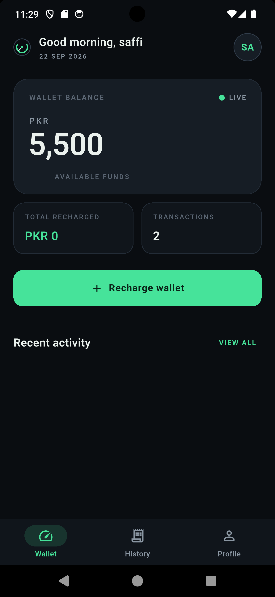
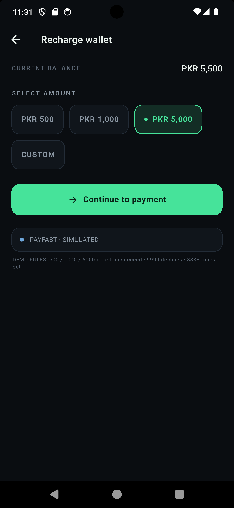
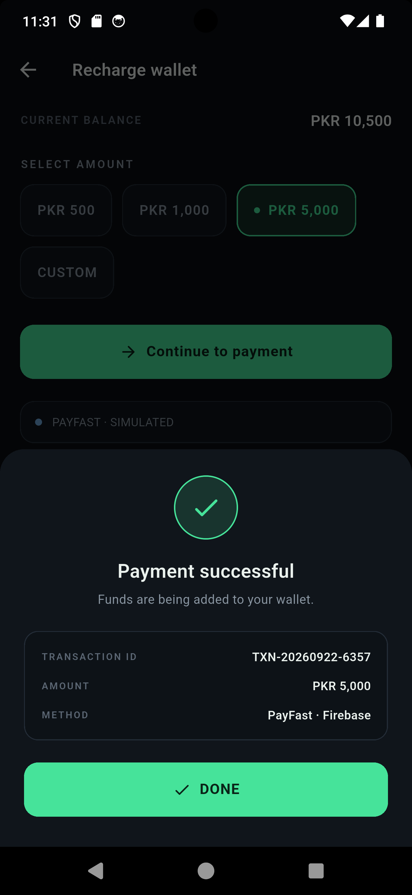
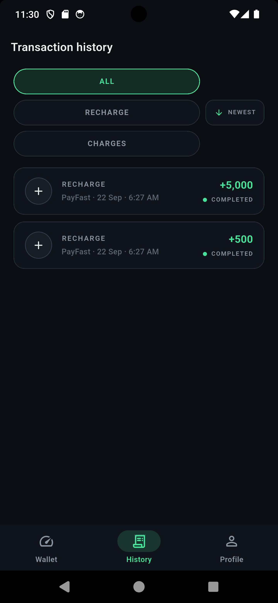
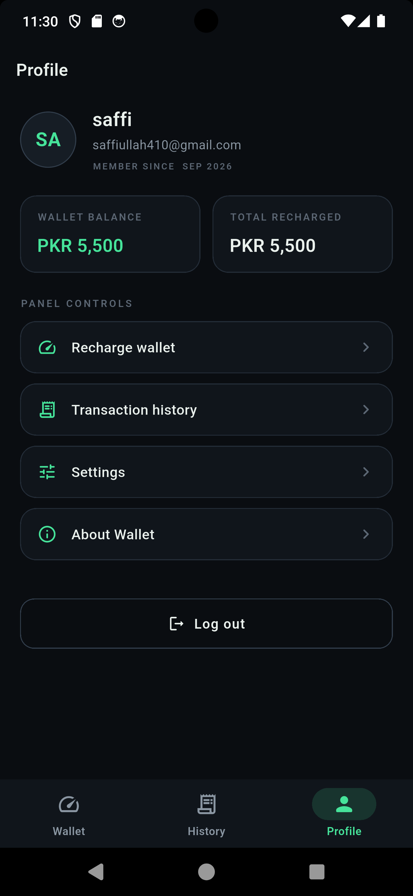

# 💳 Digital Wallet & Payment Recharge System

A modern, high-performance Flutter digital wallet application built with a sleek **dark flight-instrument UI**, secure authentication, real-time balance tracking, and seamless payment processing.

Designed to operate in **Dual Mode**:
1. **Local Mode (Zero Config):** Works instantly out-of-the-box with in-memory stores and simulated payments.
2. **Firebase Mode:** Connects to **Firebase Authentication** (Email/Password & Phone OTP with silent device verification) and **Cloud Firestore** for real-time wallet synchronization.

---

## 📱 App Screenshots

| 1. Wallet Dashboard | 2. Recharge Wallet | 3. Payment Confirmation |
| :---: | :---: | :---: |
|  |  |  |

| 4. Transaction History | 5. User Profile & Account |
| :---: | :---: |
|  |  |

---

## ✨ Key Features

* **Real-Time Wallet Dashboard:**
  * Displays current balance in PKR with live connection indicators.
  * Quick metrics: Total Recharged, Total Transactions, and Recent Activity.
* **Wallet Top-Up & Recharge:**
  * Quick-select preset amounts (PKR 500, PKR 1,000, PKR 5,000) or enter a custom amount.
  * Integrated simulated payment gateway (PayFast Pakistan lifecycle).
  * Instant feedback with payment success animation and detailed receipt.
* **Transaction History:**
  * Categorized history (All, Recharge, Charges) with status chips (`COMPLETED`, `PENDING`, `FAILED`).
  * Chronological sorting and date formatting.
* **Dual-Mode Authentication:**
  * Email & password login and registration.
  * **Phone Number Verification:** 6-digit OTP verification via Firebase Auth.
  * **Silent Device Verification:** Automatic bypass for test phone numbers (`appVerificationDisabledForTesting: true`) on emulators to prevent disruptive reCAPTCHA puzzles.
* **Clean Instrument Panel Design:**
  * Futuristic dark theme with emerald green accents, crisp typography, and micro-interactions.

---

## 🏗️ Architecture & Project Structure

The project follows a clean service-oriented architecture with decoupled UI and business logic:

```text
lib/
├── constants/       # App styling, color palettes, strings, and config limits
├── firebase/        # Firebase bootstrap and configuration detection
├── models/          # Data classes (AppUser, WalletTransaction, PaymentResult)
├── screens/         # Feature UI screens
│   ├── auth/        # Login, Register, Phone Verification
│   ├── home/        # Shell and tab navigation
│   ├── profile/     # User profile and account management
│   ├── splash/      # Splash screen and session restoration
│   ├── transactions/# Transaction history list and filters
│   └── wallet/      # Dashboard and recharge flows
├── services/        # Business logic services (AuthService, WalletService, PaymentService)
├── utils/           # Input validation (Pakistani phone, email) and formatters
└── widgets/         # Reusable design system UI components
```

---

## 🚀 Getting Started

### Prerequisites
* Flutter SDK: `^3.12.0` or later
* Dart SDK: `^3.0.0`
* Android Studio / VS Code with Flutter extensions
* Android Emulator or physical device

### 1. Clone & Install
```bash
git clone https://github.com/safi892/payment-system-demo-.git
cd payment_system
flutter pub get
```

### 2. Run the App (Zero-Config / Simulated Mode)
You can run the app immediately without setting up any backend or API keys:
```bash
flutter run
```
* **Demo Login:** Use `ali@demo.com` / `demo1234` or register a new account.
* **Simulation Rules:**
  * Any valid whole amount (`1` to `1,000,000`) succeeds.
  * Amount `9999` simulates a **Declined** transaction.
  * Amount `8888` simulates a **Timeout** scenario.

---

## 🔥 Firebase Setup (Optional)

To enable live cloud authentication and Firestore synchronization:

1. Create a project in the [Firebase Console](https://console.firebase.google.com/).
2. Add an Android app with the package name `com.example.payment_system`.
3. Add your SHA-1 and SHA-256 fingerprints:
   ```bash
   keytool -list -v -keystore ~/.android/debug.keystore -alias androiddebugkey -storepass android -keypass android
   ```
4. Download `google-services.json` and place it in:
   ```text
   android/app/google-services.json
   ```
   *(Note: This file is strictly excluded by `.gitignore` to prevent sensitive credentials from being committed to GitHub).*
5. Run the app:
   ```bash
   flutter run
   ```
   The app will automatically detect `google-services.json` and switch to live Firebase mode!

### 📱 Testing Phone Verification for Free (No Captchas & No SMS Fees)
1. In Firebase Console, navigate to **Authentication** > **Sign-in method** > **Phone**.
2. Under **Phone numbers for testing**, add:
   * **Phone:** `+92 300 0000000` (or your test number)
   * **SMS Code:** `123456`
3. In the app's phone verification screen, enter `03000000000`.
4. The app automatically skips the reCAPTCHA challenge on emulators and accepts `123456` instantly.

---

## 🔒 Security Practices

* **Zero Secret Leakage:** All Firebase credentials, service accounts, and API keys are ignored by Git via `.gitignore`.
* **Safe Input Validation:** Strict regex validation for email addresses, Pakistani phone numbers (`03XXXXXXXXX`), and currency boundaries.
* **Firestore Security Rules:** Located in `firebase/firestore.rules` to enforce authenticated read/write access per user document.

---

## 🧪 Testing & Code Quality

Verify that the code adheres to clean architecture and passes all checks:

```bash
# Check code style & lints (0 warnings)
flutter analyze

# Run unit and widget tests
flutter test
```

---

## 📄 License
This project is open-source and available under the [MIT License](LICENSE).
